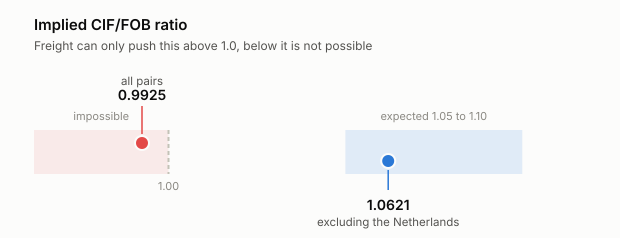
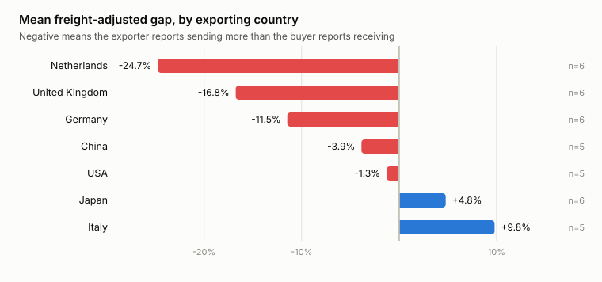

# trade-mirror

[](https://github.com/FinnTech3/trade-mirror/actions/workflows/ci.yml)

Every international trade gets counted twice — once by the country selling and
once by the country buying. This compares the two numbers and asks why they
disagree.

## What this is

When the UK sells something to Germany, both countries file a record of it. The
UK logs an export, Germany logs an import, and the two figures should describe
the same goods. They never match.

Some of the gap is innocent. An exporter values goods at its own border; an
importer values them on arrival, with shipping and insurance added. So the
buyer's number should be a few percent higher, and across the world it usually
runs about 5 to 10 percent higher. Anything left over once the freight is taken
out is worth asking about, because the leftovers track things nobody reports
directly: transit trade, valuation disputes, and in some cases goods that leave
one country and never officially arrive anywhere.

This pulls both sides of the ledger from UN Comtrade, lines them up, removes the
expected freight, and ranks what remains.

## What I found

Across 39 country pairs in 2022, the numbers came out impossible:

```
subset                             pairs   CIF/FOB   median gap
all pairs                             39    0.9925       -7.1%
excluding the Netherlands             27    1.0621       -3.0%
Netherlands as exporter                6    0.7236      -33.4%
Netherlands as importer                6    0.8007      -20.3%
```

That first row should not be possible. A ratio below 1.0 means importers
collectively recorded *less* than exporters shipped, before freight is even
considered, and freight only pushes the number up.

<picture>
  <source media="(prefers-color-scheme: dark)" srcset="docs/figures/ratio-dark.svg">
  
</picture>

Drop one country and it fixes itself. Excluding the Netherlands, the implied
freight wedge is 1.062 — right where theory says it should sit.

<picture>
  <source media="(prefers-color-scheme: dark)" srcset="docs/figures/gaps-dark.svg">
  
</picture>

The Netherlands is not mis-reporting. It runs Rotterdam, the largest port in
Europe, and an enormous volume of goods lands there, clears customs, and moves
on. The Dutch record those onward movements as Dutch exports. The country that
finally receives them records the country the goods were actually made in. So
the Netherlands reports sending far more than anyone reports receiving from it,
and the difference is not fraud, it is a port.

This is known in the trade literature as the Rotterdam effect, or quasi-transit
trade. I did not go looking for it. It fell out of the data as an arithmetic
impossibility, and working out why is what the project turned into.

### Testing that explanation instead of asserting it

"Goods are passing through" is a story, and the totals cannot tell it apart
from "the reporting is sloppy". Both produce a gap. They differ in *where* the
gap sits.

Sloppy reporting does not care what is in the container, so it would spread
across everything. Transit trade would not — it would concentrate in the
commodities a port handles on behalf of other countries. So I split the
Netherlands-to-Germany gap by what was actually traded:

```
HS  commodity                                 sent    received     gap
08  Fruit and nuts, edible                    2.5bn       0.6bn  -77.5%
09  Coffee, tea, mate and spices              0.4bn       0.1bn  -67.8%
12  Oil seeds and oleaginous fruits           1.3bn       0.5bn  -63.2%
27  Mineral fuels, mineral oils              60.3bn      24.6bn  -62.3%
32  Tanning or dyeing extracts                1.3bn       0.7bn  -51.1%
```

Bananas, coffee, oilseeds and crude oil. The Netherlands grows none of them
and drills none of them.

Mineral fuels alone are **58%** of what the Dutch report sending to Germany,
and removing that one chapter moves the pair's ratio from 0.6091 to 0.8875.
Rotterdam is the largest oil port in Europe, so this is the chapter a transit
explanation predicts before you look.

It is not proof — a concentrated gap is consistent with transit and does not
establish it. But it is a test the explanation could have failed and did not,
which is more than the aggregate figure could offer.

The UK sits second at -16.8%, which I have not explained and am not going to
pretend I have.

## Using it

```sh
git clone https://github.com/FinnTech3/trade-mirror
cd trade-mirror
pip install -e ".[dev]"
```

Rank country pairs by how far apart the two sides are:

```sh
trademirror gaps
```

Find the countries whose exports nobody records receiving:

```sh
trademirror transit
```

Split one pair's gap by what was actually in the containers:

```sh
trademirror chapters --exporter 528 --importer 276
```

```
exporter                  mean adj gap   pairs
----------------------------------------------
Netherlands                    -24.7%       6
United Kingdom                 -16.8%       6
Germany                        -11.5%       6
China                           -3.9%       5
USA                             -1.3%       5
Japan                           +4.8%       6
Italy                           +9.8%       5

implied CIF/FOB ratio, all pairs:            0.9925
implied CIF/FOB ratio, excluding Netherlands 1.0621
```

Every response is cached to `data/cache`, so a second run costs nothing and
gives the same answer. `--offline` refuses to touch the network at all.

## Getting the data out correctly

This is most of the work, and none of it shows up in the output.

### The same trade appears at several aggregation levels

A single Comtrade response contains the same goods counted more than once. The
trade is broken down by mode of transport, and separately by second partner,
and separately by customs procedure — *and* the total of each breakdown comes
back alongside the breakdown itself. Nothing on a row says whether it is a total
or a part.

Add everything up and the answer is about **5.9 times too large**. It is not
absurd enough to notice.

```
everything (the naive answer)          500 rows    $145,734,150,831
motCode == 0 only                      169 rows     $72,875,389,748
partner2Code == 0 only                  96 rows     $49,385,993,678
both, the correct filter                18 rows     $24,692,996,839
```

The customs dimension is the one I missed first, and it is the easiest to miss
because it is the only one written as a string (`C00` for all procedures, with
`C01`, `C03`, `C04`, `C06`, `C07` and `C20` summing to it). Filtering the other
two still left six rows for a single country pair. Picking among them
arbitrarily gave me Italy exporting $81.6bn to Germany while Germany recorded
$5.2bn — a 94% discrepancy I briefly believed was a finding, and which was
entirely my own bug.

A test checks that the six breakdown rows sum exactly to the total, because that
is what proves they are parts rather than separate trade.

### Numbers arrive as strings

`period` comes back as `"2022"`. It prints as a number, it reads as a number,
and it compares unequal to `2022`. Left alone it does not crash — any grouping
by year quietly matches nothing. `mosCode` does the same with `"0"`, and cost me
a filter that silently discarded every row in the dataset.

Types are coerced at the boundary now, with a test asserting it.

### Not every partner is a country

"World", "EU-27", "Africa CAMEU region, nes" and "Other Asia, nes" sit in the
partner list looking exactly like France. The reference tables carry an
`isGroup` flag; the data rows do not. Compare a country against a group and you
have compared a thing with a set containing it.

### The endpoint truncates without saying so

The public preview API returns at most 500 rows and gives no sign when it has
cut you off — a truncated response is shaped exactly like a complete one. Worse,
asking for one country's trade with *all* partners spends those 500 rows on
breakdowns long before the partner list runs out, so what you get is an
arbitrary slice. My first attempt found **zero** mirror pairs for exactly this
reason: the UK response covered partner codes 562 to 724, the German one covered
12 to 876, and neither contained the other.

The fix is to name both countries in every query, which costs two requests per
ordered pair and makes the whole thing quadratic. That is why this studies eight
countries rather than two hundred.

## Decisions and trade-offs

**A missing side is not a zero.** When one country reports a trade and the other
does not, the pair is dropped and counted, never filled in with zero. Absence
almost always means that country did not report that year, and treating it as
"reported nothing" would manufacture a 100% discrepancy out of a hole in the
data. This is why coverage is 70% rather than 100%, and I would rather have 39
pairs I trust than 56 I do not.

**The freight adjustment is a single global constant**, 1.08. This is the
weakest thing in the project. The real wedge varies by route, by commodity and
by year — bulk goods over long distances cost far more to ship as a share of
value than electronics over short ones. A constant is defensible for ranking
pairs against each other and indefensible for saying anything precise about one
pair. The `--cif-fob` flag exists so the assumption can be moved and the
conclusions re-checked, which is the least I can do about it.

**Responses are cached, and the cache is the unit of reproducibility.** Comtrade
revises historical data. Without a cache, running the same analysis twice can
give different answers for reasons that have nothing to do with the code.

**Eight countries, one year, all commodities.** Each additional country costs 2n
more requests against a free public service that rate-limits at roughly one
request per second. The commodity dimension is where the interesting work is —
gaps concentrate in particular goods — and this does not touch it.

## Testing

37 tests, all offline. Every one runs against recorded API responses in
`tests/fixtures`, so the suite needs no network and cannot break because the UN
revised a number.

The regressions are the ones that matter, because each is a bug that produced a
plausible wrong answer rather than an error:

- the unfiltered sum is several times too large
- the six customs rows sum exactly to the total, proving they are subtotals
- `period` is an `int` after parsing, not the string that arrives
- `mosCode` really is `"0"` and not `0`
- groups and unknown codes are not treated as countries
- a truncated response reports itself as truncated
- the HS reference file parses despite its UTF-8 byte-order mark, which
  makes a plain `json.loads` fail with a decode error that names no cause

## What I would do differently

**Break the commodity view out across every pair.** The chapter split runs
for one country pair at a time. Doing it for all of them would show whether
the concentration pattern holds generally or is a Rotterdam peculiarity.

**Use a real freight model** instead of one number, or estimate the wedge per
route from the data and look at deviations from that.

**More countries and more years.** Eight countries in one year is enough to find
the Rotterdam effect and not enough to say anything general. A time series would
show whether gaps move with tariff changes, which is the question I actually
wanted to ask.

**Explain the UK.** Second-largest negative gap in the set and I have no account
of it. London is an entrepôt too, and the period covers a change in how UK-EU
trade is recorded, but I have tested neither and will not claim them.

## Sources

Data from [UN Comtrade](https://comtradeplus.un.org/), public preview API. See
[docs/SOURCES.md](docs/SOURCES.md).

## License

MIT. See [LICENSE](LICENSE).
